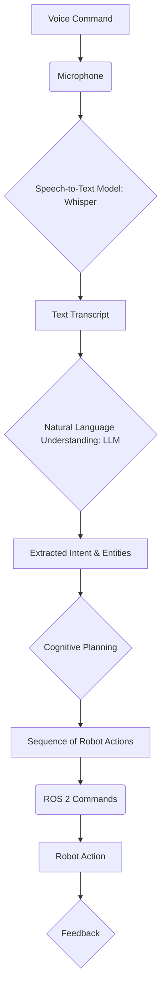

# Voice-to-Action with Whisper

Integrating voice commands into robotics allows for a more natural and intuitive human-robot interaction. This chapter explores the workflow of converting spoken language into actionable commands for a robot, with a focus on using OpenAI's Whisper model for robust speech-to-text conversion.

## The Voice-to-Action Workflow

The process of translating a voice command into a robot action typically involves several sequential steps:

1.  **Voice Input**: A microphone captures the user's spoken command.
2.  **Speech-to-Text (STT)**: The raw audio is processed by a Speech-to-Text model (like Whisper) to convert it into a textual transcript.
3.  **Natural Language Understanding (NLU)**: The text transcript is then analyzed to extract its meaning, intent, and any relevant entities (e.g., objects, locations, actions). This often involves a Large Language Model (LLM) or a dedicated NLU system.
4.  **Cognitive Planning**: Based on the extracted intent and entities, and considering the robot's current state and environment, a plan is formulated. This plan breaks down the high-level command into a sequence of executable robot actions.
5.  **Action Execution**: The individual actions from the plan are translated into low-level robot commands (e.g., ROS 2 actions, service calls, topic messages) and sent to the robot's control system.
6.  **Robot Action**: The robot executes the commands, performing the desired physical action.
7.  **Feedback (Optional)**: The robot might provide auditory or visual feedback to the user, confirming the action or asking for clarification.

## Role of OpenAI Whisper

OpenAI Whisper is a general-purpose speech recognition model. It is trained on a large dataset of diverse audio and is capable of transcribing speech in multiple languages, as well as translating those languages into English. Its robustness to accents, background noise, and technical jargon makes it an excellent choice for robotics applications where clear audio input might not always be guaranteed.

### Integrating Whisper

Whisper can be integrated into a ROS 2 system by wrapping its Python API within a ROS 2 node. This node would:
-   Subscribe to a ROS 2 topic carrying raw audio data (e.g., from a microphone driver).
-   Buffer the incoming audio.
-   Process the buffered audio with the Whisper model.
-   Publish the resulting text transcript to another ROS 2 topic (e.g., `whisper/transcript`).

This architecture allows the speech-to-text functionality to be modular and reusable within the larger robot system.
